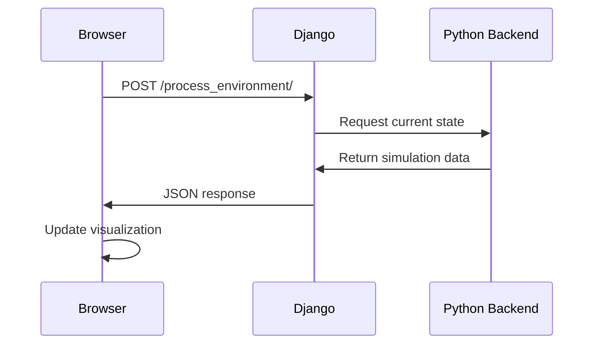

# API Reference and Data Structures

This document provides comprehensive API reference and data structure documentation for the Local Generative Agents system.

## Table of Contents

1. [Backend API Reference](#backend-api-reference)
2. [Frontend API Reference](#frontend-api-reference)
3. [Data Structures](#data-structures)
4. [Communication Protocols](#communication-protocols)
5. [Configuration Reference](#configuration-reference)

---

## Backend API Reference

### ReverieServer Class

The main simulation controller that manages the entire simulation state.

```python
class ReverieServer:
    def __init__(self, fork_sim_code: str, sim_code: str)
    def open_server(self) -> None
    def step(self) -> Dict[str, Any]
    def save_simulation(self, name: str) -> bool
    def load_simulation(self, name: str) -> bool
    def run_simulation(self, steps: int) -> None
```

#### Methods

##### `__init__(fork_sim_code: str, sim_code: str)`
Initializes a new simulation instance.

**Parameters:**
- `fork_sim_code`: Name of the base simulation to fork from
- `sim_code`: Name for the new simulation instance

**Example:**
```python
server = ReverieServer("base_the_ville_isabella_maria_klaus", "my_simulation")
```

##### `step() -> Dict[str, Any]`
Executes one simulation step and returns the updated world state.

**Returns:**
```python
{
    "step": int,
    "world_state": {
        "agents": {
            "agent_name": {
                "position": [x, y],
                "action": "current_action",
                "target": "destination",
                "status": "activity_description"
            }
        },
        "interactions": [...],
        "environment_changes": [...]
    }
}
```

##### `save_simulation(name: str) -> bool`
Saves the current simulation state to disk.

**Parameters:**
- `name`: Name for the saved simulation

**Returns:** `True` if successful, `False` otherwise

##### `run_simulation(steps: int) -> None`
Runs the simulation for a specified number of steps.

**Parameters:**
- `steps`: Number of simulation steps to execute

### Persona Class

Represents an individual agent with cognitive capabilities.

```python
class Persona:
    def __init__(self, name: str, folder_mem_saved: str = None)
    def perceive(self, maze: Maze) -> List[str]
    def retrieve(self, query: str) -> List[Memory]
    def plan(self, maze: Maze) -> List[Action]
    def reflect(self) -> List[Insight]
    def execute(self, maze: Maze, actions: List[Action]) -> bool
    def converse(self, target_persona: 'Persona') -> str
    def save(self, save_folder: str) -> None
```

#### Methods

##### `perceive(maze: Maze) -> List[str]`
Observes the environment and returns perceived events.

**Parameters:**
- `maze`: The current maze/environment state

**Returns:** List of perceived event descriptions

##### `retrieve(query: str) -> List[Memory]`
Retrieves relevant memories based on the query context.

**Parameters:**
- `query`: Context or question to search memories for

**Returns:** List of relevant Memory objects ranked by relevance

##### `plan(maze: Maze) -> List[Action]`
Generates a plan of actions based on current goals and environment.

**Parameters:**
- `maze`: Current environment state

**Returns:** List of planned Action objects

### Maze Class

Represents the 2D world environment with spatial navigation.

```python
class Maze:
    def __init__(self, maze_name: str)
    def get_collision_maze(self) -> List[List[int]]
    def get_tile_path(self, position: Tuple[int, int]) -> str
    def access_tile(self, position: Tuple[int, int]) -> Dict[str, Any]
    def turn_coordinate_to_tile(self, position: Tuple[int, int]) -> Tuple[int, int]
    def turn_tile_coordinate_to_coordinate(self, tile_pos: Tuple[int, int]) -> Tuple[int, int]
```

#### Methods

##### `access_tile(position: Tuple[int, int]) -> Dict[str, Any]`
Returns detailed information about a specific tile.

**Parameters:**
- `position`: (x, y) coordinate of the tile

**Returns:**
```python
{
    "world": "world_name",
    "sector": "sector_name", 
    "arena": "arena_name",
    "game_object": "object_name",
    "collision": bool,
    "spawning_location": "spawn_point_name"
}
```

---

## Frontend API Reference

### Django Views

Located in `environment/frontend_server/translator/views.py`

#### `landing(request)`
Renders the main landing page.

**URL:** `/`
**Method:** GET
**Returns:** Rendered landing page template

#### `home(request)`
Renders the live simulation interface.

**URL:** `/simulator_home`
**Method:** GET
**Returns:** Live simulation viewer template

#### `demo(request, sim_code, step, play_speed)`
Renders compressed simulation playback.

**URL:** `/demo/<sim_code>/<step>/<play_speed>/`
**Method:** GET
**Parameters:**
- `sim_code`: Simulation identifier
- `step`: Starting step number
- `play_speed`: Playback speed (1-5)

**Returns:** Demo playback template with compressed data

#### `process_environment(request)`
AJAX endpoint for environment state updates.

**URL:** `/process_environment/`
**Method:** POST
**Content-Type:** `application/json`

**Request Body:**
```json
{
    "step": 123,
    "request_type": "update_state"
}
```

**Response:**
```json
{
    "status": "success",
    "agents": {
        "agent_name": {
            "position": [x, y],
            "action": "current_action",
            "conversation": "dialogue_text"
        }
    },
    "environment_updates": [...]
}
```

### JavaScript API (Phaser.js Integration)

Located in templates (e.g., `demo/main_script.html`)

#### Game Configuration
```javascript
const config = {
    type: Phaser.AUTO,
    width: 1500,
    height: 800,
    parent: "game-container",
    pixelArt: true,
    physics: {
        default: "arcade",
        arcade: {
            gravity: { y: 0 }
        }
    },
    scene: {
        preload: preload,
        create: create,
        update: update
    }
};
```

#### Key Functions

##### `preload()`
Loads game assets including tilesets and sprites.

##### `create()`
Initializes the game world and sets up rendering layers.

##### `update()`
Called every frame to update agent positions and animations.

---

## Data Structures

### Memory Data Structures

#### Memory Node
```python
class Memory:
    created: datetime
    expiration: datetime  
    s: str              # Subject
    p: str              # Predicate  
    o: str              # Object
    description: str
    keywords: Set[str]
    poignancy: int      # Importance score (1-10)
    embedding: List[float]  # Vector embedding
    embedding_key: str
    retrieved: int      # Times retrieved
    last_accessed: datetime
```

#### Spatial Memory Tree
```python
{
    "double_studio": {
        "double_studio": {
            "bedroom_1": ["bed", "painting", "desk", "closet"],
            "bedroom_2": ["bed", "easel", "closet"],
            "bathroom": ["toilet", "shower", "sink"],
            "kitchen": ["refrigerator", "stove", "sink", "counter"]
        }
    }
}
```

#### Scratch Memory
```python
class Scratch:
    # Current activity and location
    curr_time: datetime
    curr_tile: Tuple[int, int]
    daily_plan_req: str
    name: str
    first_name: str
    last_name: str
    age: int
    innate: str         # Personality traits
    learned: str        # Learned behaviors
    currently: str      # Current activity
    lifestyle: str      # Lifestyle description
    
    # Planning and execution
    daily_req: List[str]
    f_daily_schedule: List[Dict]
    f_daily_schedule_hourly_org: Dict[int, str]
    act_address: str
    act_start_time: datetime
    act_duration: int
    act_description: str
    act_pronunciatio: str
    act_event: Tuple[str, str]
    
    # Social interactions
    chatting_with: str
    chat: List[List[str]]
    chatting_with_buffer: Dict
    chatting_end_time: datetime
    
    # Pathfinding
    planned_path: List[Tuple[int, int]]
```

### Environment Data Structures

#### Tile Information
```python
{
    "world": str,           # e.g., "double studio"
    "sector": str,          # e.g., "double studio"  
    "arena": str,           # e.g., "bedroom 2"
    "game_object": str,     # e.g., "easel", "painting"
    "spawning_location": str # e.g., "bedroom-2-a"
}
```

#### Agent Position
```python
{
    "name": str,
    "x": int,               # Tile x coordinate
    "y": int,               # Tile y coordinate  
    "facing": str,          # "up", "down", "left", "right"
    "action": str,          # Current action description
    "target": Tuple[int, int], # Target destination
    "path": List[Tuple[int, int]] # Planned path
}
```

### Communication Data Structures

#### Simulation Step Response
```python
{
    "step": int,
    "datetime": str,        # ISO format datetime
    "agents": {
        "agent_name": {
            "position": [x, y],
            "action": str,
            "target": str,
            "status": str,
            "conversation": {
                "with": str,        # Other agent name
                "dialogue": str,    # Current dialogue
                "started": str      # Start time
            }
        }
    },
    "environment_changes": [
        {
            "type": str,        # "object_moved", "interaction", etc.
            "location": [x, y],
            "description": str
        }
    ],
    "interactions": [
        {
            "agents": [str, str],   # Agent names
            "type": str,            # "conversation", "collision", etc.
            "location": [x, y],
            "description": str
        }
    ]
}
```

#### Chat/Conversation Format
```python
{
    "participants": [str, str],     # Agent names
    "messages": [
        {
            "speaker": str,         # Agent name
            "message": str,         # Dialogue text
            "timestamp": datetime,
            "location": [x, y]
        }
    ],
    "started": datetime,
    "ended": datetime,
    "summary": str                  # AI-generated summary
}
```

---

## Communication Protocols

### AJAX Communication Pattern

The frontend uses AJAX to communicate with the Django backend:



### Request/Response Cycle

#### Environment Update Request
```javascript
fetch('/process_environment/', {
    method: 'POST',
    headers: {
        'Content-Type': 'application/json',
        'X-CSRFToken': csrfToken
    },
    body: JSON.stringify({
        'step': currentStep,
        'request_type': 'update_state'
    })
})
.then(response => response.json())
.then(data => updateVisualization(data));
```

#### Response Processing
```javascript
function updateVisualization(data) {
    // Update agent positions
    for (const [agentName, agentData] of Object.entries(data.agents)) {
        updateAgentPosition(agentName, agentData.position);
        updateAgentAction(agentName, agentData.action);
        updateAgentConversation(agentName, agentData.conversation);
    }
    
    // Process environment changes
    data.environment_changes.forEach(change => {
        processEnvironmentChange(change);
    });
}
```

### File-Based Communication

For simulation persistence and replay:

#### Simulation Storage Structure
```
environment/frontend_server/storage/
├── simulation_name/
│   ├── movement/
│   │   ├── step_001.json
│   │   ├── step_002.json
│   │   └── ...
│   ├── personas/
│   │   ├── agent_name/
│   │   │   ├── bootstrap_memory/
│   │   │   │   ├── associative_memory/
│   │   │   │   ├── spatial_memory.json
│   │   │   │   └── scratch.json
│   │   │   └── saved_memories/
│   │   └── ...
│   └── meta.json
```

#### Movement Data Format
```json
{
    "step": 123,
    "agents": {
        "Isabella Rodriguez": {
            "position": [45, 67],
            "action": "cooking breakfast",
            "target": "kitchen counter",
            "path": [[45, 67], [46, 67], [47, 67]],
            "conversation": {
                "with": "Maria Lopez",
                "dialogue": "Good morning! How did you sleep?",
                "started": "2023-07-01T08:30:00"
            }
        }
    }
}
```

---

## Configuration Reference

### Backend Configuration (`utils.py`)

```python
# OpenAI API Configuration
openai_api_key = "sk-..."
key_owner = "Your Name"

# File Paths
maze_assets_loc = "../../environment/frontend_server/static_dirs/assets"
env_matrix = f"{maze_assets_loc}/the_ville/matrix"
env_visuals = f"{maze_assets_loc}/the_ville/visuals"
fs_storage = "../../environment/frontend_server/storage"
fs_temp_storage = "../../environment/frontend_server/temp_storage"

# Simulation Parameters
collision_block_id = "32125"
sec_per_step = 10                   # Seconds per simulation step
steps_per_hour = 360               # Simulation steps per game hour

# Cognitive Parameters
retrieve_limit = 15                # Max memories to retrieve
reflect_threshold = 100            # Memory importance threshold for reflection
conversation_range = 2             # Tile range for conversation initiation

# Debug Settings
debug = True
verbose_logging = True
save_frequency = 50               # Save every N steps
```

### Frontend Configuration (Django Settings)

```python
# Database Configuration
DATABASES = {
    'default': {
        'ENGINE': 'django.db.backends.sqlite3',
        'NAME': os.path.join(BASE_DIR, 'db.sqlite3'),
    }
}

# Static Files
STATIC_URL = '/static/'
STATIC_ROOT = os.path.join(os.path.dirname(BASE_DIR), "static_root")
STATICFILES_DIRS = (
    os.path.join(BASE_DIR, "static_dirs"),
)

# Media Files
MEDIA_URL = '/media/'
MEDIA_ROOT = os.path.join(os.path.dirname(BASE_DIR), "media_root")

# CORS Configuration
CORS_ORIGIN_ALLOW_ALL = True
CORS_ALLOW_CREDENTIALS = False
```

### Phaser.js Configuration

```javascript
// Game Engine Settings
const config = {
    type: Phaser.AUTO,
    width: 1500,
    height: 800,
    parent: "game-container",
    pixelArt: true,
    physics: {
        default: "arcade",
        arcade: {
            gravity: { y: 0 }
        }
    },
    scale: { zoom: 0.8 }
};

// Tilemap Configuration  
const tileSize = 32;
const mapWidth = 140;   // tiles
const mapHeight = 100;  // tiles

// Animation Settings
const walkSpeed = 100;        // pixels per second
const animationFPS = 8;       // frames per second
const conversationRange = 64; // pixels
```

### Environment Configuration

#### Maze Meta Information (`maze_meta_info.json`)
```json
{
    "maze_width": 140,
    "maze_height": 100,
    "sq_tile_size": 32,
    "special_constraint": ""
}
```

#### Agent Configuration
```json
{
    "name": "Isabella Rodriguez",
    "age": 34,
    "personality": "outgoing and friendly",
    "occupation": "artist",
    "lifestyle": "Isabella is an artist who loves to paint and spend time in nature",
    "initial_location": "double studio:double studio:bedroom 2:bed",
    "memory_capacity": 1000,
    "reflection_threshold": 100
}
```

This API reference provides the foundation for integrating with and extending the Local Generative Agents system. All data structures and protocols are designed to be extensible while maintaining backward compatibility.