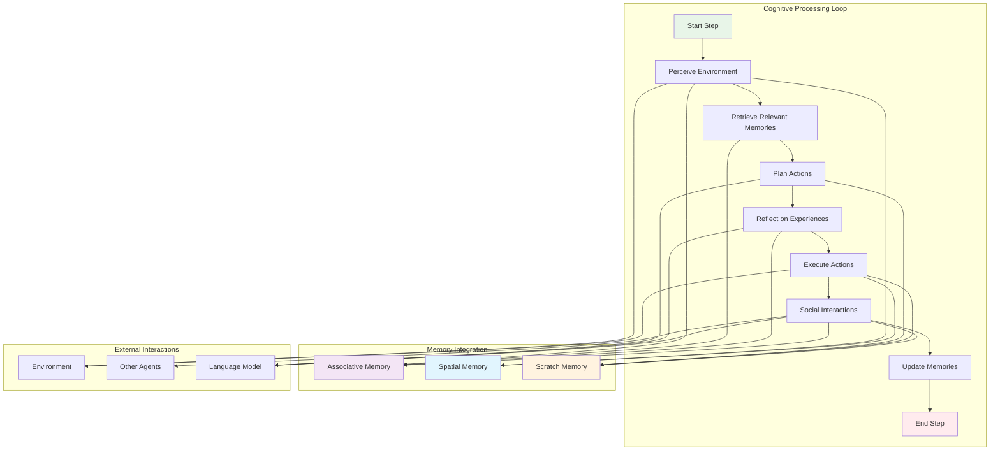
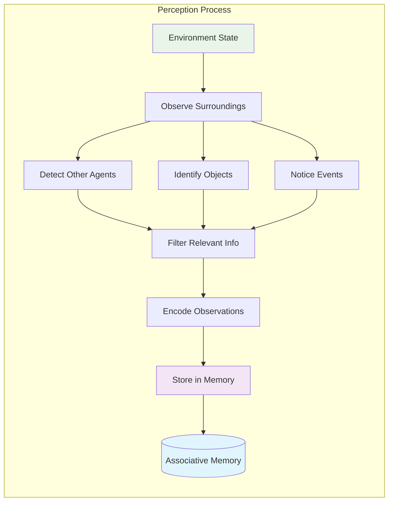
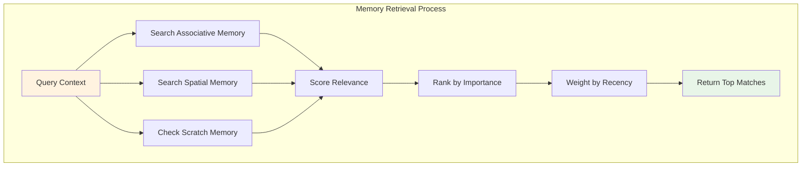
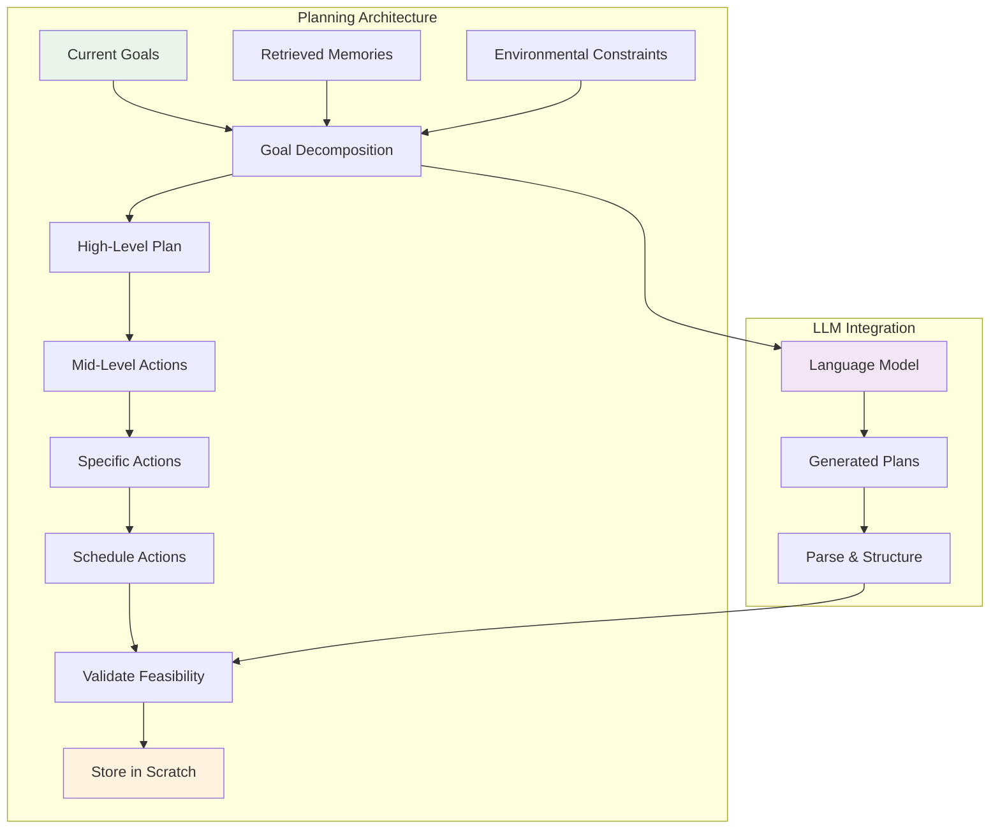
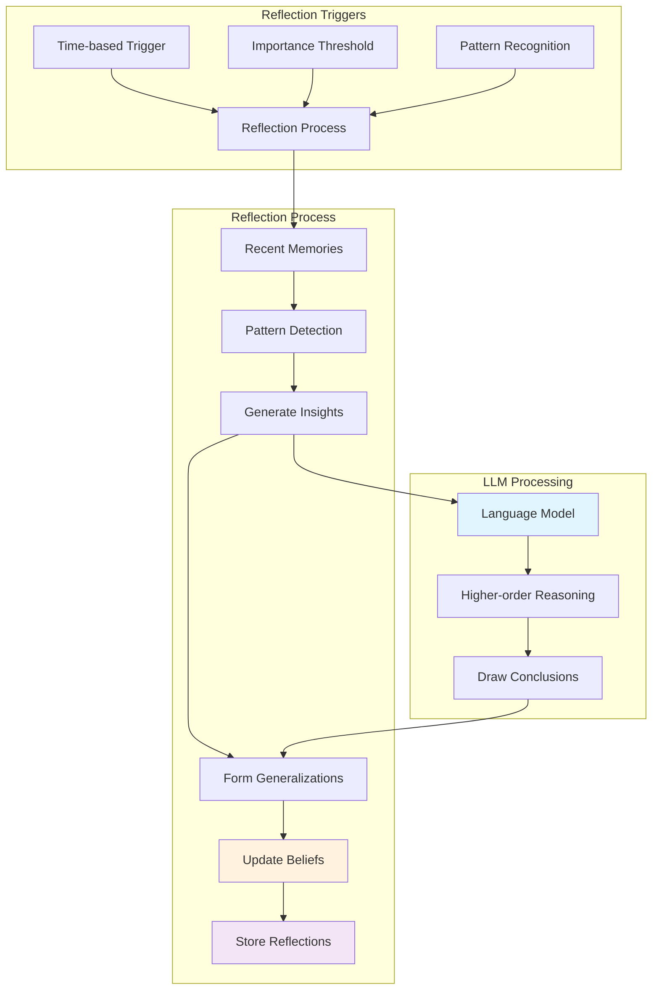
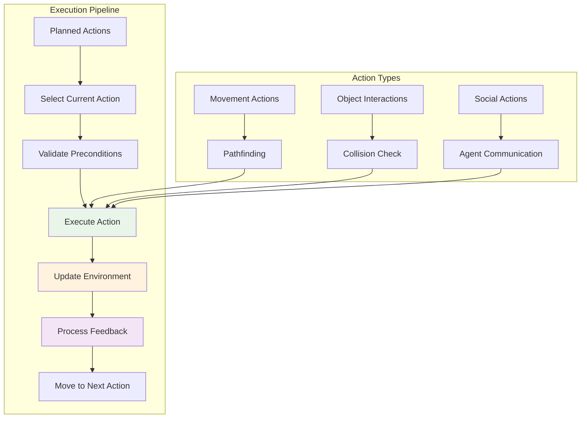
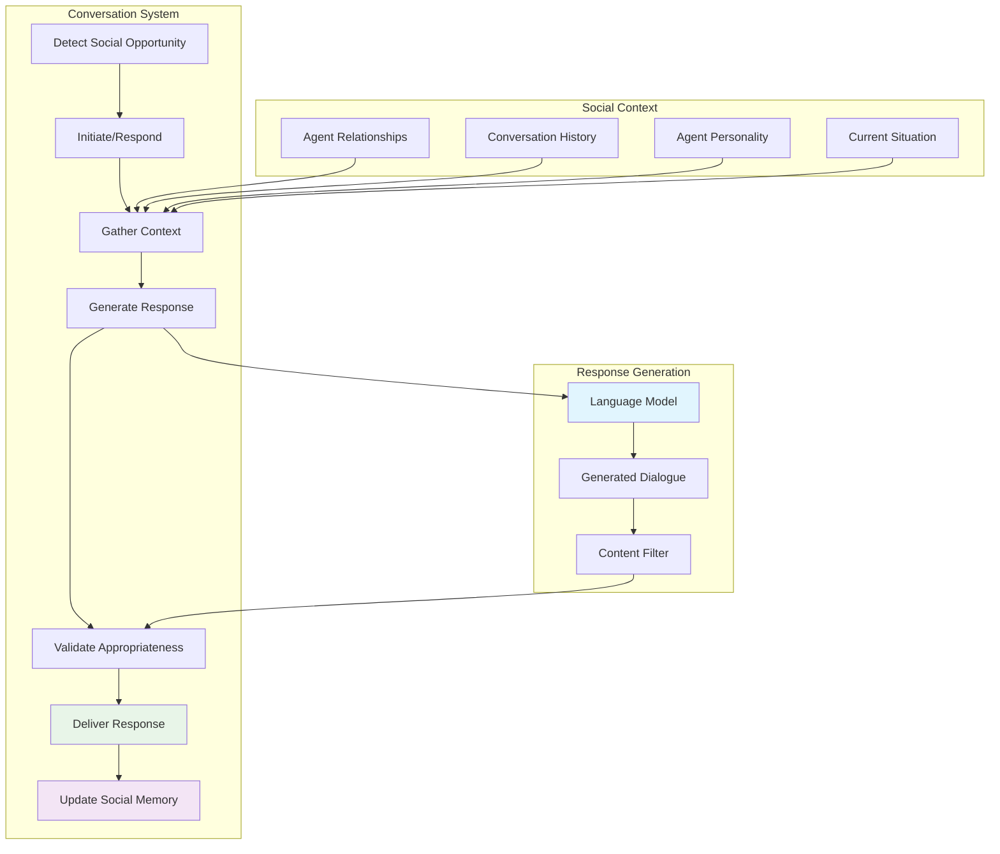

# Agent Cognitive Architecture Guide

This document provides detailed technical documentation for the agent cognitive architecture in the Local Generative Agents simulation system.

## Overview

Each agent (Persona) in the simulation implements a sophisticated cognitive architecture that simulates human-like reasoning, memory, and behavior. The architecture consists of multiple cognitive modules working together to create believable autonomous agents.

## Cognitive Processing Pipeline

## Cognitive Modules

### 1. Perceive Module

**File**: `persona/cognitive_modules/perceive.py`

The Perceive module handles environmental observation and information gathering.

**Key Functions**:
- `perceive()`: Main perception function that processes environmental input
- `get_nearby_agents()`: Detects other agents within perception range
- `observe_objects()`: Identifies objects and their states
- `encode_observation()`: Converts observations into memory format

**Input**: Current environment state, agent positions, object states
**Output**: Encoded observations stored in associative memory

### 2. Retrieve Module

**File**: `persona/cognitive_modules/retrieve.py`

The Retrieve module queries the agent's memory systems to find relevant information.

**Key Functions**:
- `retrieve()`: Main retrieval function with context-based search
- `get_relevant_memories()`: Finds memories matching current context
- `importance_score()`: Calculates memory importance scores
- `recency_weight()`: Applies temporal decay to memory relevance

**Input**: Query context, search parameters
**Output**: Ranked list of relevant memories

### 3. Plan Module

**File**: `persona/cognitive_modules/plan.py`

The Plan module generates hierarchical plans and decomposes high-level goals into actionable steps.

**Key Functions**:
- `plan()`: Main planning function that creates action hierarchies
- `decompose_goal()`: Breaks down high-level goals into sub-goals
- `generate_schedule()`: Creates temporal schedule for actions
- `validate_plan()`: Checks plan feasibility against constraints

**Input**: Current goals, retrieved memories, environmental state
**Output**: Hierarchical action plan stored in scratch memory

### 4. Reflect Module

**File**: `persona/cognitive_modules/reflect.py`

The Reflect module performs higher-order reasoning to form insights and generalizations from experiences.

**Key Functions**:
- `reflect()`: Main reflection function that processes recent experiences
- `identify_patterns()`: Detects patterns in memory stream
- `generate_insights()`: Creates higher-order insights using LLM
- `update_beliefs()`: Modifies agent's beliefs based on reflections

**Input**: Recent memory stream, current beliefs
**Output**: Reflective insights stored as high-importance memories

### 5. Execute Module

**File**: `persona/cognitive_modules/execute.py`

The Execute module carries out planned actions in the environment.

**Key Functions**:
- `execute()`: Main execution function that carries out actions
- `validate_action()`: Checks if action can be performed
- `perform_movement()`: Handles agent movement in environment
- `interact_object()`: Manages object interactions

**Input**: Planned actions from scratch memory
**Output**: Environment modifications, position updates

### 6. Converse Module

**File**: `persona/cognitive_modules/converse.py`

The Converse module manages social interactions and conversations with other agents.

**Key Functions**:
- `converse()`: Main conversation function
- `initiate_conversation()`: Starts new conversations
- `respond_to_conversation()`: Generates responses to other agents
- `update_relationship()`: Modifies relationship status with other agents

**Input**: Social context, other agents, conversation history
**Output**: Dialogue text, updated social memories

## Memory Integration

The cognitive modules integrate seamlessly with the three memory systems:

### Associative Memory Integration
- **Write Operations**: Perceive, Reflect, Converse modules store new memories
- **Read Operations**: Retrieve module queries for relevant memories
- **Update Operations**: All modules can modify memory importance scores

### Spatial Memory Integration
- **Write Operations**: Perceive module updates location knowledge
- **Read Operations**: Plan and Execute modules query spatial information
- **Update Operations**: Execute module updates object positions

### Scratch Memory Integration
- **Write Operations**: Plan module stores current plans and goals
- **Read Operations**: Execute and Converse modules read current state
- **Update Operations**: All modules can modify temporary state

## Language Model Integration

Several cognitive modules integrate with language models for advanced reasoning:

### Query Patterns
1. **Planning Queries**: Goal decomposition and action generation
2. **Reflection Queries**: Pattern analysis and insight generation  
3. **Conversation Queries**: Dialogue generation and social reasoning

### Prompt Templates
Located in `persona/prompt_template/`, these templates structure LLM queries:
- `run_gpt_prompt_planning_v1.txt`: Planning prompts
- `run_gpt_prompt_reflect_v1.txt`: Reflection prompts  
- `run_gpt_prompt_converse_v1.txt`: Conversation prompts

## Performance Considerations

### Cognitive Load Management
- **Selective Processing**: Not all modules run every step
- **Importance Filtering**: Focus on high-relevance information
- **Batch Processing**: Group similar operations for efficiency

### Memory Optimization
- **Decay Functions**: Reduce importance of old memories
- **Compression**: Summarize similar memories
- **Selective Storage**: Filter low-importance observations

### LLM Usage Optimization
- **Query Batching**: Combine multiple requests
- **Caching**: Store common response patterns
- **Rate Limiting**: Manage API usage costs

## Configuration and Tuning

### Module Parameters
Each cognitive module has configurable parameters:
- **Perception Range**: How far agents can observe
- **Memory Retrieval Limit**: Maximum memories to retrieve
- **Planning Horizon**: How far ahead to plan
- **Reflection Frequency**: How often to reflect
- **Conversation Probability**: Likelihood of social interaction

### Personality Integration
Agent personalities influence cognitive processing:
- **Extraversion**: Affects conversation initiation
- **Openness**: Influences reflection depth
- **Conscientiousness**: Affects planning detail
- **Neuroticism**: Modifies stress responses
- **Agreeableness**: Influences social interactions

## Extension Points

The cognitive architecture is designed for extensibility:

### Adding New Modules
1. Create new module file in `cognitive_modules/`
2. Implement standard interface methods
3. Register module in persona initialization
4. Add integration hooks with memory systems

### Customizing Existing Modules  
1. Override specific methods in persona subclass
2. Modify prompt templates for different behaviors
3. Adjust module parameters for different personality types
4. Add new memory integration patterns

This cognitive architecture provides the foundation for creating believable, autonomous agents that can adapt, learn, and interact in complex social environments.