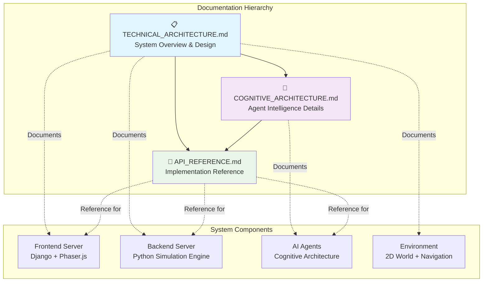

# Documentation Index

This directory contains comprehensive technical documentation for the Local Generative Agents simulation system.

## Documentation Structure

### 📋 [TECHNICAL_ARCHITECTURE.md](./TECHNICAL_ARCHITECTURE.md)
**Main technical architecture overview**

Complete system architecture documentation including:
- High-level system overview with mermaid diagrams
- Frontend and backend architecture details
- Component interaction flows
- Data layer and storage systems
- Development and deployment guides

**Start here** for understanding the overall system design.

### 🧠 [COGNITIVE_ARCHITECTURE.md](./COGNITIVE_ARCHITECTURE.md)  
**Deep dive into agent cognitive systems**

Detailed documentation of the agent cognitive architecture:
- Cognitive processing pipeline
- Individual cognitive modules (Perceive, Retrieve, Plan, Reflect, Execute, Converse)
- Memory system integration
- Language model integration patterns
- Performance considerations and tuning

**Essential reading** for understanding how agents think and behave.

### 📡 [API_REFERENCE.md](./API_REFERENCE.md)
**Complete API and data structure reference**

Comprehensive API documentation covering:
- Backend Python API (ReverieServer, Persona, Maze classes)
- Frontend Django API (views, endpoints, responses)
- Data structures and formats
- Communication protocols
- Configuration reference

**Reference guide** for developers integrating with or extending the system.

## Architecture Overview Diagram

## Key Documentation Features

### 🎨 Visual Architecture Diagrams
All documents include comprehensive Mermaid diagrams showing:
- System component relationships
- Data flow between services  
- Cognitive processing pipelines
- Memory system architectures
- Communication patterns

### 🔧 Implementation Details
Each document provides:
- Code examples and snippets
- Configuration templates
- File structure layouts
- Class and method signatures
- Data format specifications

### 🚀 Development Guidance
Documentation includes:
- Setup and installation instructions
- Development workflow recommendations  
- Testing and debugging approaches
- Deployment architecture options
- Performance optimization strategies

## Reading Guide by Role

### 👨‍💼 **Project Managers / Stakeholders**
Start with [TECHNICAL_ARCHITECTURE.md](./TECHNICAL_ARCHITECTURE.md):
- System Overview section
- High-Level Architecture diagrams
- Key Features summary
- Deployment Guide

### 🎨 **Frontend Developers**  
Focus on [TECHNICAL_ARCHITECTURE.md](./TECHNICAL_ARCHITECTURE.md):
- Frontend Architecture section
- Data Flow and Communication
- Then reference [API_REFERENCE.md](./API_REFERENCE.md) for Django views and JavaScript APIs

### 🔧 **Backend Developers**
Start with [TECHNICAL_ARCHITECTURE.md](./TECHNICAL_ARCHITECTURE.md):
- Backend Architecture section
- Then dive into [COGNITIVE_ARCHITECTURE.md](./COGNITIVE_ARCHITECTURE.md) for agent implementation details
- Use [API_REFERENCE.md](./API_REFERENCE.md) for class references and data structures

### 🤖 **AI/ML Researchers**
Focus on [COGNITIVE_ARCHITECTURE.md](./COGNITIVE_ARCHITECTURE.md):
- Cognitive Processing Pipeline
- Individual cognitive modules
- Memory system integration
- Language model integration patterns

### 🔗 **Integration Developers**
Start with [API_REFERENCE.md](./API_REFERENCE.md):
- Backend API Reference
- Communication Protocols
- Data Structures
- Configuration Reference

### 🌐 **DevOps Engineers**
Focus on [TECHNICAL_ARCHITECTURE.md](./TECHNICAL_ARCHITECTURE.md):
- Deployment Guide section
- Scaling Considerations
- Performance Optimization
- Configuration management

## Quick Start Guide

1. **🎯 Understanding the System**: Read the System Overview in [TECHNICAL_ARCHITECTURE.md](./TECHNICAL_ARCHITECTURE.md)

2. **🔍 Exploring Components**: Use the component-specific sections:
   - Frontend details in [TECHNICAL_ARCHITECTURE.md](./TECHNICAL_ARCHITECTURE.md)
   - Agent cognition in [COGNITIVE_ARCHITECTURE.md](./COGNITIVE_ARCHITECTURE.md)
   - APIs and data in [API_REFERENCE.md](./API_REFERENCE.md)

3. **💻 Development Setup**: Follow the Development Setup guide in [TECHNICAL_ARCHITECTURE.md](./TECHNICAL_ARCHITECTURE.md)

4. **🔧 Implementation**: Reference specific APIs and data structures in [API_REFERENCE.md](./API_REFERENCE.md)

## Documentation Standards

### Diagram Conventions
- **Blue components**: Core system services
- **Green components**: Data and memory systems  
- **Purple components**: AI and cognitive systems
- **Orange components**: UI and visualization
- **Pink components**: External services

### Code Examples
All code examples follow these conventions:
- Python examples use type hints where applicable
- JavaScript examples use modern ES6+ syntax
- Configuration examples include comments explaining purpose
- API examples include complete request/response cycles

### File References  
All file paths are relative to the repository root:
- `reverie/backend_server/` - Python backend code
- `environment/frontend_server/` - Django frontend code  
- `docs/` - This documentation directory

## Contributing to Documentation

When updating the system, please maintain documentation:

1. **Architecture Changes**: Update diagrams in [TECHNICAL_ARCHITECTURE.md](./TECHNICAL_ARCHITECTURE.md)
2. **Cognitive Updates**: Update module details in [COGNITIVE_ARCHITECTURE.md](./COGNITIVE_ARCHITECTURE.md)  
3. **API Changes**: Update signatures and examples in [API_REFERENCE.md](./API_REFERENCE.md)
4. **New Features**: Add to appropriate sections with diagrams and examples

## Additional Resources

### Research Paper
- "Generative Agents: Interactive Simulacra of Human Behavior" ([arXiv:2304.03442](https://arxiv.org/abs/2304.03442))

### External Dependencies  
- Django Web Framework
- Phaser.js Game Engine
- OpenAI API
- Python packages (see `requirements.txt`)

### Community
- GitHub Repository: [ReZonArc/local_generative_agents](https://github.com/ReZonArc/local_generative_agents)
- Issues and discussions on GitHub

---

*This documentation is maintained alongside the codebase and represents the current system architecture. Last updated with the technical architecture documentation initiative.*