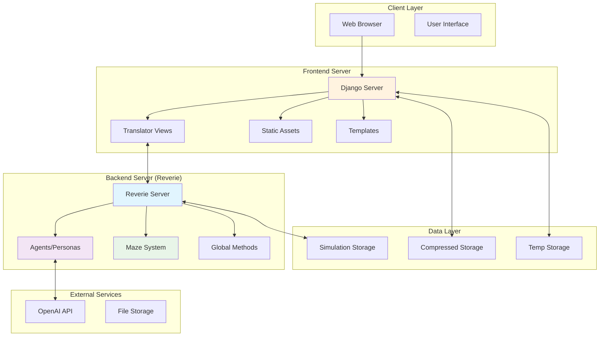
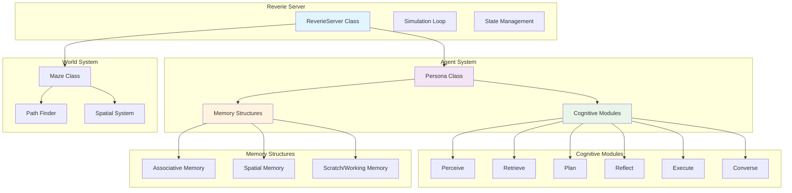
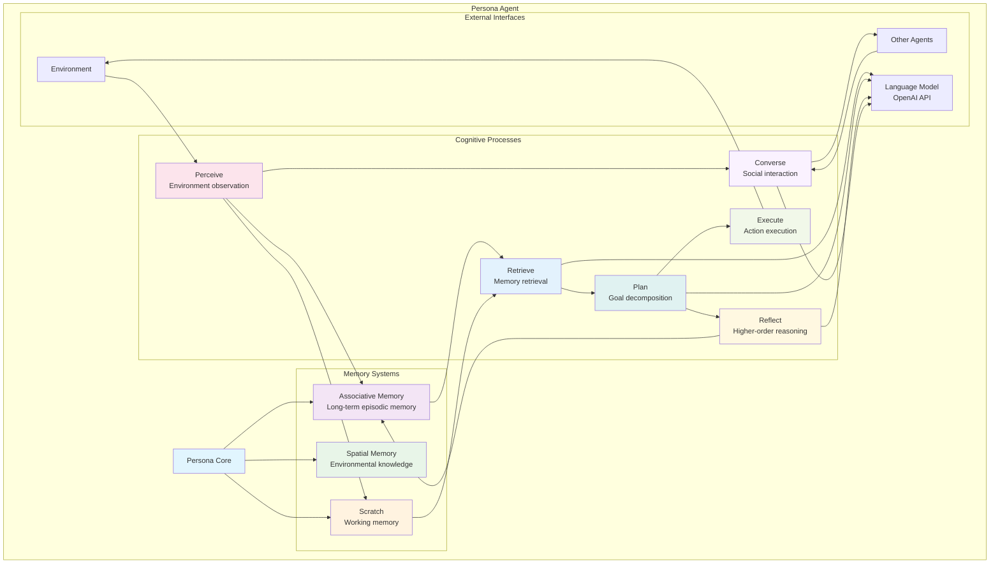
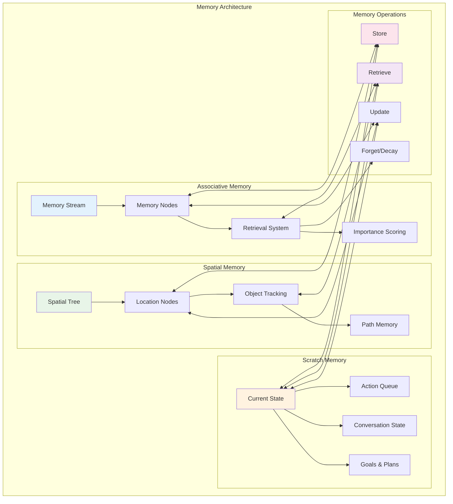
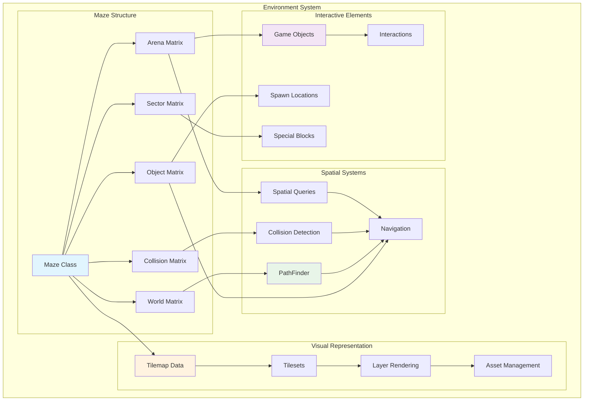
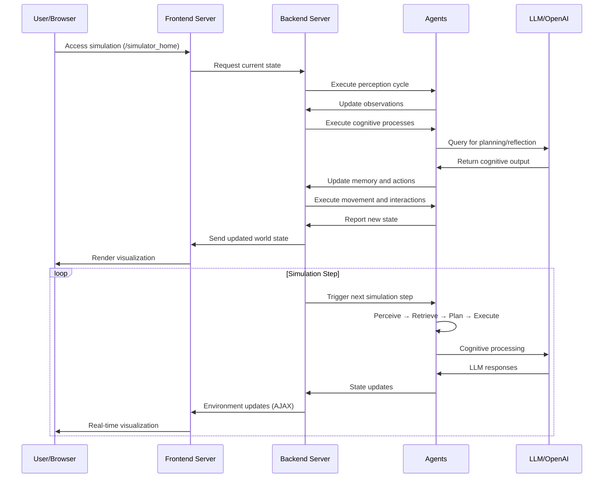
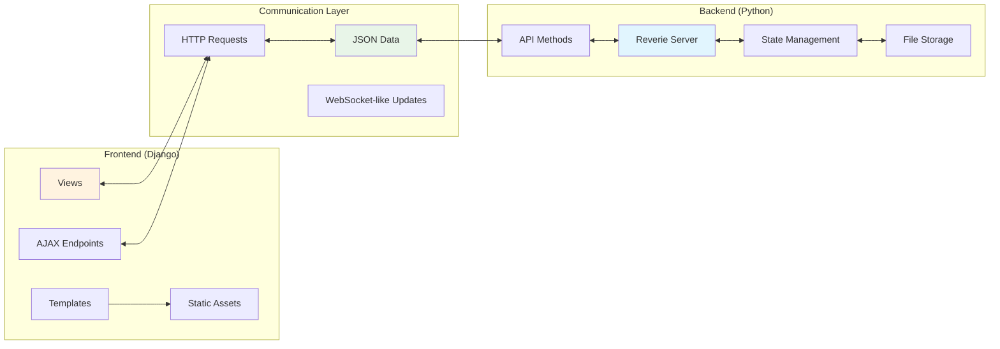
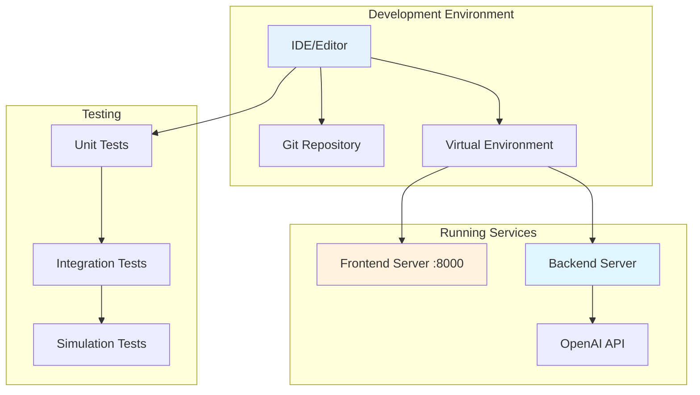
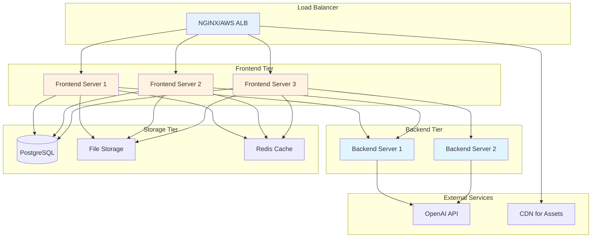

# Technical Architecture Documentation
## Local Generative Agents Simulation System

This document provides comprehensive technical architecture documentation for the Local Generative Agents simulation system, based on the "Generative Agents: Interactive Simulacra of Human Behavior" research paper.

---

## Table of Contents

1. [System Overview](#system-overview)
2. [High-Level Architecture](#high-level-architecture)
3. [Backend Architecture](#backend-architecture)
4. [Frontend Architecture](#frontend-architecture)
5. [Agent Cognitive Architecture](#agent-cognitive-architecture)
6. [Memory System Architecture](#memory-system-architecture)
7. [Environment and Maze System](#environment-and-maze-system)
8. [Data Flow and Communication](#data-flow-and-communication)
9. [API Endpoints](#api-endpoints)
10. [Development Setup](#development-setup)
11. [Deployment Guide](#deployment-guide)

---

## System Overview

The Local Generative Agents system is a sophisticated simulation platform that creates believable human-like AI agents capable of autonomous behavior, memory formation, and social interaction. The system consists of two main components:

- **Backend Server (Reverie)**: Python-based simulation engine managing agent cognition, memory, and world state
- **Frontend Server**: Django-based web application providing visualization and user interaction

### Key Features

- **Autonomous AI Agents**: Personas with memory, planning, and social capabilities
- **Interactive Environment**: 2D world with spatial navigation and object interaction
- **Real-time Simulation**: Live visualization of agent behaviors and interactions
- **Memory Systems**: Spatial, associative, and working memory for each agent
- **Cognitive Modules**: Perception, retrieval, planning, reflection, execution, and conversation

---

## High-Level Architecture



---

## Backend Architecture

The backend system is implemented in Python and serves as the core simulation engine.

### Core Components



### Key Classes and Responsibilities

| Class | File | Responsibility |
|-------|------|----------------|
| `ReverieServer` | `reverie.py` | Main simulation controller, manages simulation state and step execution |
| `Persona` | `persona/persona.py` | Individual agent with memory, cognition, and behavior |
| `Maze` | `maze.py` | World representation, spatial navigation, collision detection |
| `PathFinder` | `path_finder.py` | A* pathfinding algorithm for agent movement |
| `AssociativeMemory` | `memory_structures/associative_memory.py` | Long-term memory storage and retrieval |
| `SpatialMemory` | `memory_structures/spatial_memory.py` | Spatial knowledge and location memory |
| `Scratch` | `memory_structures/scratch.py` | Working memory and current state |

---

## Frontend Architecture

The frontend is a Django web application providing visualization and user interaction.

```mermaid
graph TB
    subgraph "Django Application"
        DS[Django Server]
        URL[URL Dispatcher]
        VIEW[Translator Views]
        TEMP[Templates]
        STATIC[Static Files]
    end
    
    subgraph "Client-Side"
        HTML[HTML Templates]
        JS[JavaScript/Phaser.js]
        CSS[CSS Styles]
        ASSETS[Game Assets]
    end
    
    subgraph "View Functions"
        LAND[landing()]
        HOME[home()]
        DEMO[demo()]
        REPLAY[replay()]
        PROC[process_environment()]
    end
    
    subgraph "Rendering Engine"
        PHAS[Phaser.js Game Engine]
        TILE[Tilemap System]
        SPRI[Sprite Management]
        ANIM[Animation System]
    end
    
    DS --> URL
    URL --> VIEW
    VIEW --> LAND
    VIEW --> HOME
    VIEW --> DEMO
    VIEW --> REPLAY
    VIEW --> PROC
    VIEW --> TEMP
    TEMP --> HTML
    HTML --> JS
    HTML --> CSS
    JS --> PHAS
    PHAS --> TILE
    PHAS --> SPRI
    PHAS --> ANIM
    STATIC --> ASSETS
    
    style DS fill:#fff3e0
    style PHAS fill:#e8f5e8
    style VIEW fill:#f3e5f5
```

### URL Patterns and Views

| URL Pattern | View Function | Purpose |
|-------------|---------------|---------|
| `/` | `landing` | Main landing page |
| `/simulator_home` | `home` | Live simulation viewer |
| `/demo/<sim_code>/<step>/<speed>/` | `demo` | Compressed simulation playback |
| `/replay/<sim_code>/<step>/` | `replay` | Simulation replay for debugging |
| `/process_environment/` | `process_environment` | AJAX endpoint for environment updates |
| `/update_environment/` | `update_environment` | AJAX endpoint for state updates |

---

## Agent Cognitive Architecture

Each agent (Persona) implements a sophisticated cognitive architecture inspired by human cognition.



### Cognitive Module Details

#### Perceive Module
- **Purpose**: Observe and process environmental information
- **Input**: Current environment state, nearby agents, objects
- **Output**: Perceived events stored in associative memory
- **Key Functions**: Object detection, agent recognition, spatial awareness

#### Retrieve Module  
- **Purpose**: Query memory systems for relevant information
- **Input**: Current context, query parameters
- **Output**: Retrieved memories ranked by relevance
- **Key Functions**: Memory search, relevance scoring, recency weighting

#### Plan Module
- **Purpose**: Generate and decompose goals into actionable plans
- **Input**: Current state, goals, retrieved memories
- **Output**: Hierarchical action plans
- **Key Functions**: Goal decomposition, scheduling, constraint satisfaction

#### Reflect Module
- **Purpose**: Form higher-order insights about experiences
- **Input**: Recent memories, patterns
- **Output**: Reflective insights and generalizations
- **Key Functions**: Pattern recognition, insight generation, belief updating

#### Execute Module
- **Purpose**: Carry out planned actions in the environment
- **Input**: Action plans, current context
- **Output**: Environment modifications, movement
- **Key Functions**: Action validation, path execution, object interaction

#### Converse Module
- **Purpose**: Manage social interactions and conversations
- **Input**: Conversation context, other agents
- **Output**: Dialogue responses, social updates
- **Key Functions**: Dialogue generation, social reasoning, relationship tracking

---

## Memory System Architecture

The memory system is designed to simulate human-like memory formation, storage, and retrieval.



### Memory Types and Structures

#### Associative Memory
- **Structure**: Time-ordered stream of events
- **Content**: Experiences, observations, thoughts, conversations
- **Indexing**: Temporal, semantic, importance-based
- **Decay**: Gradual importance reduction over time
- **Format**: `[event_type, created_time, expiration_time, subject, predicate, object]`

#### Spatial Memory
- **Structure**: Hierarchical tree (World → Sector → Arena → Objects)
- **Content**: Location knowledge, object positions, spatial relationships
- **Navigation**: Support for pathfinding and spatial queries
- **Updates**: Real-time based on agent movement and observation

#### Scratch/Working Memory
- **Structure**: Current state variables
- **Content**: Immediate plans, current activity, temporary information
- **Persistence**: Session-based, not permanent
- **Purpose**: Support real-time decision making

---

## Environment and Maze System

The simulation environment represents a 2D world with spatial navigation, collision detection, and interactive objects.



### Maze Data Structure

The maze system uses multiple 2D matrices to represent different aspects of the world:

| Matrix Type | Purpose | Data Source |
|-------------|---------|-------------|
| **Collision Matrix** | Movement constraints and walls | `collision_maze.csv` |
| **Sector Matrix** | High-level area divisions | `sector_maze.csv` |
| **Arena Matrix** | Room and location definitions | `arena_maze.csv` |  
| **Object Matrix** | Interactive objects and furniture | `game_object_maze.csv` |

### Special Blocks System

Special blocks are defined by color-coded tiles in the Tiled map editor:

| Block Type | File | Purpose |
|------------|------|---------|
| **World Blocks** | `world_blocks.csv` | Top-level world areas |
| **Sector Blocks** | `sector_blocks.csv` | Major districts/zones |
| **Arena Blocks** | `arena_blocks.csv` | Specific rooms/locations |
| **Game Object Blocks** | `game_object_blocks.csv` | Interactive elements |
| **Spawning Location Blocks** | `spawning_location_blocks.csv` | Agent spawn points |

---

## Data Flow and Communication

### Simulation Flow Diagram



### Frontend-Backend Communication



### Key Data Exchange Formats

#### Environment Update (AJAX)
```json
{
  "step": 123,
  "agents": {
    "agent_name": {
      "position": [x, y],
      "action": "action_description",
      "status": "current_activity",
      "conversation": "dialogue_text"
    }
  },
  "environment_changes": {
    "objects": {...},
    "interactions": [...]
  }
}
```

#### Agent State
```json
{
  "name": "Isabella Rodriguez",
  "position": [45, 67],
  "current_action": "cooking breakfast",
  "current_area": "kitchen",
  "memory_stream": [...],
  "plans": [...],
  "conversations": [...]
}
```

---

## API Endpoints

### Frontend Server Endpoints

| Method | Endpoint | Parameters | Purpose |
|--------|----------|------------|---------|
| GET | `/` | - | Landing page |
| GET | `/simulator_home` | - | Live simulation interface |
| GET | `/demo/<sim_code>/<step>/<speed>/` | sim_code, step, speed | Compressed simulation playback |
| GET | `/replay/<sim_code>/<step>/` | sim_code, step | Debug replay interface |
| POST | `/process_environment/` | step, agents_data | Process environment updates |
| POST | `/update_environment/` | environment_data | Update environment state |
| GET | `/path_tester/` | - | Pathfinding test interface |
| POST | `/path_tester_update/` | path_data | Update pathfinding test |

### Backend Server Methods

| Method | Parameters | Returns | Purpose |
|--------|------------|---------|---------|
| `open_server()` | - | - | Start simulation server |
| `run_simulation(steps)` | steps: int | - | Execute simulation steps |
| `save_simulation(name)` | name: str | - | Save current state |
| `load_simulation(name)` | name: str | - | Load saved state |
| `step()` | - | world_state | Execute single simulation step |

---

## Development Setup

### Prerequisites
- Python 3.9.12+
- Node.js (for frontend assets)
- OpenAI API key

### Installation Steps

1. **Clone Repository**
   ```bash
   git clone <repository_url>
   cd local_generative_agents
   ```

2. **Create Virtual Environment**
   ```bash
   python -m venv venv
   source venv/bin/activate  # On Windows: venv\Scripts\activate
   ```

3. **Install Dependencies**
   ```bash
   pip install -r requirements.txt
   ```

4. **Configure Backend**
   Create `reverie/backend_server/utils.py`:
   ```python
   # OpenAI API Configuration
   openai_api_key = "<Your OpenAI API Key>"
   key_owner = "<Your Name>"
   
   # File Paths
   maze_assets_loc = "../../environment/frontend_server/static_dirs/assets"
   env_matrix = f"{maze_assets_loc}/the_ville/matrix"
   env_visuals = f"{maze_assets_loc}/the_ville/visuals"
   fs_storage = "../../environment/frontend_server/storage"
   fs_temp_storage = "../../environment/frontend_server/temp_storage"
   
   # Configuration
   collision_block_id = "32125"
   debug = True
   ```

5. **Start Frontend Server**
   ```bash
   cd environment/frontend_server
   python manage.py runserver
   ```

6. **Start Backend Server**
   ```bash
   cd reverie/backend_server
   python reverie.py
   ```

### Development Workflow



---

## Deployment Guide

### Production Deployment

#### Docker Configuration
```dockerfile
# Backend Dockerfile
FROM python:3.9.12-slim

WORKDIR /app
COPY requirements.txt .
RUN pip install -r requirements.txt

COPY reverie/ ./reverie/
COPY environment/ ./environment/

EXPOSE 8000
CMD ["python", "reverie/backend_server/reverie.py"]
```

#### Environment Variables
```bash
# Production environment variables
OPENAI_API_KEY=<production_api_key>
DEBUG=False
DJANGO_SECRET_KEY=<production_secret>
DATABASE_URL=<production_database>
STATIC_ROOT=/app/static/
MEDIA_ROOT=/app/media/
```

#### Deployment Architecture



### Scaling Considerations

1. **Backend Scaling**
   - Simulation state is stateful - consider session affinity
   - OpenAI API rate limiting requires request queuing
   - Memory usage scales with number of agents

2. **Frontend Scaling**
   - Stateless Django application
   - Static assets served via CDN
   - Database connection pooling

3. **Performance Optimization**
   - Redis caching for frequently accessed data
   - Asynchronous processing for LLM calls
   - Optimized pathfinding algorithms

---

## Conclusion

This technical architecture documentation provides a comprehensive overview of the Local Generative Agents simulation system. The architecture demonstrates a sophisticated approach to AI agent simulation, combining advanced cognitive modeling with practical web-based visualization.

### Key Architectural Strengths

1. **Modular Design**: Clear separation between cognitive modules, memory systems, and environment
2. **Scalable Architecture**: Separate frontend/backend allows independent scaling
3. **Extensible Framework**: Plugin-like cognitive modules for easy enhancement
4. **Rich Memory Model**: Multiple memory systems simulate human-like cognition
5. **Interactive Environment**: Real-time visualization and user interaction

### Future Enhancement Opportunities

1. **Distributed Simulation**: Support for multi-server simulations
2. **Advanced AI Models**: Integration with newer language models
3. **Enhanced Visualization**: 3D environment rendering
4. **Mobile Support**: Responsive design for mobile devices
5. **API Extensions**: RESTful APIs for external integrations

---

*This documentation is maintained alongside the codebase and should be updated as the system evolves.*